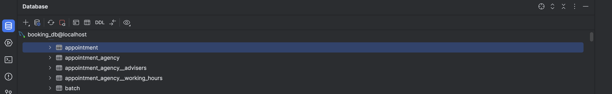

# Appointment Module
This is a custom Drupal module that allows users to book appointments.
## Features
- Book an appointment
- List all appointments
- Manage appointment settings
## Installation
1. Place the `appointment` module in the `/modules/custom/` directory of your Drupal installation.
2. Enable the module via the Drupal admin interface or use Drush with the following command:
   ```bash
   drush en appointment -y

## Installation Output

- A new taxonomy vocabulary named Appointment Types is created.
- Two taxonomy terms are created under the Appointment Types vocabulary: Business Appointment, Professional Staff
- A new role named Advisor is created.
- A new user with the Advisor role is created.
# How to Book an Appointment
Follow these steps to book an appointment using the system:
## Step 1: Choose an Agency
1. **Navigate to the Booking Form:**
  - Go to the booking form page (e.g., `/prendre-un-rendez-vous`).
2. **Select an Agency:**
  - A list of agencies will be displayed as cards.
  - Click on the card of the agency you want to book an appointment with.
   
3. **Click "Next":**
  - After selecting an agency, click the **Next** button to proceed to the next step.
---
## Step 2: Select Appointment Type
1. **Choose an Appointment Type:**
  - A list of appointment types (e.g., Business Appointment, Professional Staff) will be displayed.
  - Select the type of appointment you need.
   
2. **Click "Next":**
  - After selecting an appointment type, click the **Next** button to proceed.
### Step 3: Select an Advisor
#### Choose an Advisor:
- A list of available advisors will be displayed.
- Select the advisor you want to book the appointment with.
  
#### Click "Next":
- After selecting an advisor, click the **Next** button to proceed.
---
### Step 4: Select Date and Time

#### Choose a Date and Time:
- A calendar will be displayed, showing available time slots.
- Select a date and time for your appointment.
#### Click "Next":
- After selecting a date and time, click the **Next** button to proceed.
---
### Step 5: Enter Personal Information

#### Fill in Your Details:
Enter your personal information, including:
- **First Name**
- **Last Name**
- **Phone Number**
- **Email Address**
- Agree to the terms and conditions by checking the box.
#### Click "Next":
- After filling in your details, click the **Next** button to proceed.
---
### Step 6: Confirm Appointment

#### Review Your Appointment Details:
A summary of your appointment details will be displayed, including:
- **Appointment Type**
- **Advisor**
- **Date and Time**
- **Your Personal Information**
#### Confirm Your Appointment:
- If everything is correct, click the **Confirm** button to book your appointment.
- The appointment is created correctly !
#### Review Your Appointment Details:
A summary of your appointment details will be displayed, including:
- **Appointment Type**
- **Advisor**
- **Date and Time**
- **Your Personal Information**
### Email Confirmation


## Database Schema :


## BackOffice Administration :


## Conclusion
The Appointment Booking System provides a seamless and user-friendly way to book appointments. Follow the steps outlined above to book your appointment.
